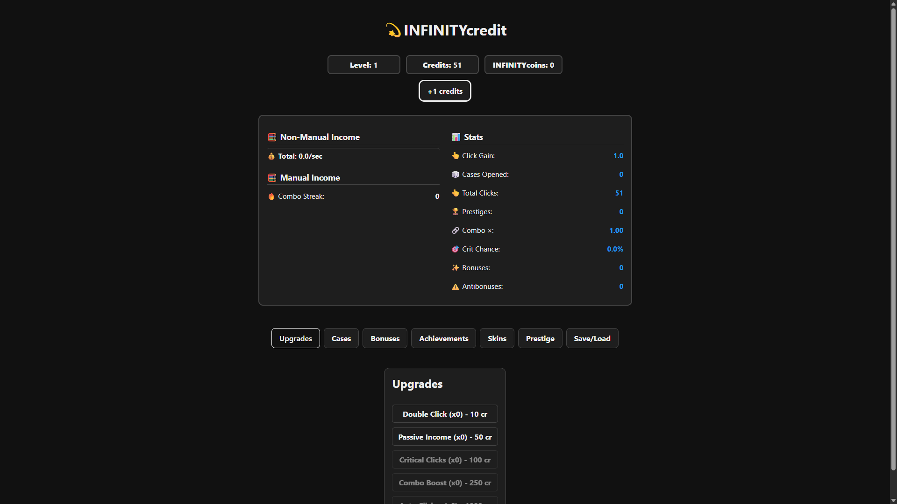
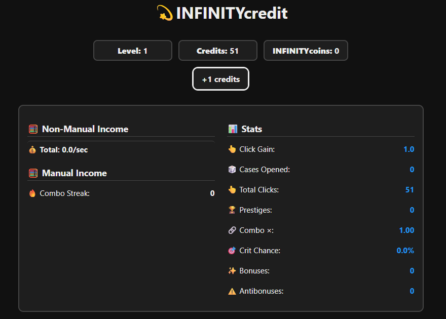
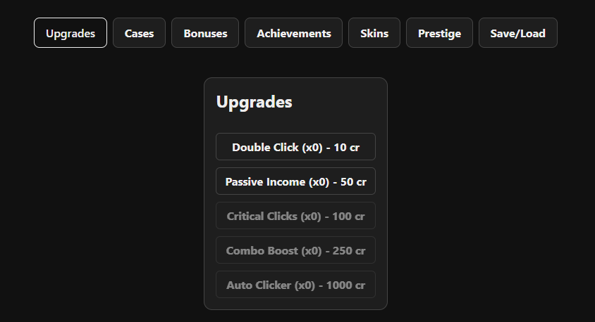

# 💫 INFINITYcredit
> An infinite clicker game of endless upgrades, bonuses, combos, prestige... and cosmic infinite wealth.

---

## 🌐 PLAY NOW

🔗 [Play INFINITYcredit](https://github.com/Remeraldb/INFINITYcredit)  

---

## 📸 Screenshots

| Fullscreen view |
|--------------|
|  |

| Main Clicker UI |
|--------------|
|  |

| Tab view with Upgrades tab |
|--------------|
|  |

TabViewUpgrades_Screenshot.png
---

## 🎮 How to Play

1. **Click the big(or not-so-big) button** to earn credits.
2. Spend credits on **Upgrades** to be able to gain more credits.
3. Open **Cases** (unlocked at different levels) to win bonuses or risk getting antibonuses.
4. Gather **Bonuses** to multiply your income or activate effects.
5. Unlock **Achievements** as you reach key milestones related to different parts of the gameplay process.
6. Use **Prestige** to reset progress and earn **INFINITYcoins**.
7. Use **INFINITYcoins** to unlock **Skins**, changing the entire game's theme.
8. View **Stats** in the Effects Panel.
9. Export or Import your game save at any time.

---

## ⚙️ Features

- ✅ Manual clicking 
- ✅ Non-manual income systems
- ✅ Combo system with increasing rewards
- ✅ Critical hit mechanic
- ✅ Upgrades system
- ✅ Bonus / Antibonus system
- ✅ Level progression with unlockable cases
- ✅ Achievements (80+)
- ✅ Prestige system with INFINITYcoins
- ✅ Skins with full UI theming
- ✅ Save/Load via JSON file
- ✅ Floating credit bubbles
- ✅ Sound and visual effects
- ✅ Statistics panel with:
  - Total clicks
  - Cases opened
  - Combo streak
  - Critical chance
  - Combo multiplier
  - Prestige count
  - Bonus/antibonus counters, etc.

---

## 🧪 Technologies

- React + Vite + JS
- SCSS Modules
- Framer Motion
- Custom Hooks

---

## 🚀 Local Installation (optional)

```bash
git clone https://github.com/Remeraldb/INFINITYcredit
cd INFINITYcredit
npm install
npm run dev
